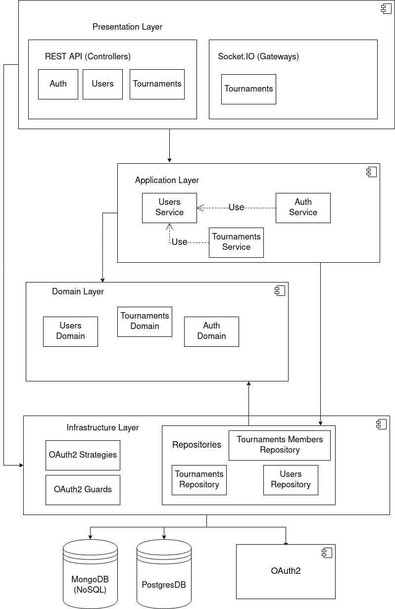

# TEST GAME "Tournaments"

## Technology stack

- NodeJS
- NestJS
- TypeORM
- MongoDB
- PostgresDB
- Sockets
- Cron
- AWS (S3)
- Passport (OAuth2)

## Architecture



## Running the application

> Since I **don't have** an AWS/Azure account, I will use minio instead of S3, but to use it I will use aws-sdk

> First you need to set the environment values ​​using **`.env.example`** file as an example

After that you need to initialize all application dependencies ( minio, mongodb, postgresdb)

```bash
  $ docker-compose up
```

After that you can compile and run the project itself:

```bash
  $ yarn run start:dev # or npm run start:dev
```

## API Usage

> To see which endpoints and which headers/parameters to set I used **`swagger`** for this

You need to follow the link:

```
  <host>/api
```

## **Dependencies**:

```json
{
  "@aws-sdk/client-s3": "^3.179.0",
  "@aws-sdk/s3-request-presigner": "^3.183.0",
  "@nestjs/jwt": "^9.0.0",
  "@nestjs/mongoose": "^9.2.0",
  "@nestjs/passport": "^9.0.0",
  "@nestjs/platform-express": "^9.0.0",
  "@nestjs/platform-socket.io": "^9.1.2",
  "@nestjs/swagger": "^6.1.2",
  "@nestjs/typeorm": "^9.0.1",
  "@nestjs/websockets": "^9.1.2",
  "@types/passport-google-oauth20": "^2.0.11",
  "class-transformer": "^0.5.1",
  "class-validator": "^0.13.2",
  "mongoose": "^6.6.2",
  "passport": "^0.6.0",
  "passport-google-oauth20": "^2.0.0",
  "pg": "^8.8.0",
  "socket.io": "^4.5.2",
  "typeorm": "^0.3.10"
}
```
